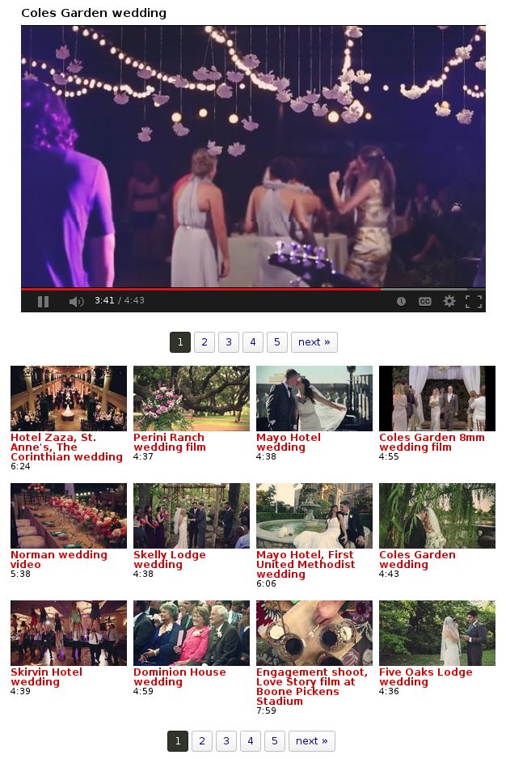

.. index::
   single: video gallery; overview

Video Galleries
===============

Creating video galleries is how TubePress made a name for itself. The software lets you easily embed beautiful,
highly-functional thumbnail galleries throughout you site, and you complete control over the entire process.
A live demo of a TubePress gallery can be seen `here <http://tubepress.com/demo/>`_.

The process to create a video gallery is always the same ...

 1. **Choose which videos to display**. Out of the box, TubePress supports a multitude of YouTube and Vimeo
    video sources. More video providers are on the way!

 2. **Configure TubePress to display those videos**. Check the
    :doc:`user manual for your environment <../../manual/index>` for details on how to do this.

 3. **Add the gallery to a website**. Again this process is different depending on your environment, so please
    refer to your specific :doc:`user manual <../../manual/index>`.

.. _video-galleries-multiple-sources-feature:

.. index::
   single: video gallery; multiple sources

Video Galleries from Multiple Sources
-------------------------------------

.. note:: This feature is currently only available with the downloadable TubePress Pro. It is not yet available
          on the cloud-hosted TubePress services, but that functionality is coming soon.

With TubePress Pro, you can create galleries that are composed of video from multiple video sources. TubePress can even
combine videos from multiple video providers - for instance, you can easily have YouTube and Vimeo videos
intermingled in the same gallery!

As an example, say that you want to create a single gallery containing videos from the following sources, all combined
into a single gallery:

 * the YouTube playlist ``F5D324185EE73FEC``
 * uploads from YouTube user ``bbc``
 * uploads from YouTube user ``funnyordie``
 * YouTube search for the exact term "spirit of truth"
 * the Vimeo album ``140484``

This is easy to accomplish with TubePress Pro. The trick is to use ``+`` in some of your shortcode options to combine
the sources. For the example above, the TubePress shortcode might look like this:

.. code-block:: php

  [tubepress mode="playlist + user + tag + vimeoAlbum" playlistValue="F5D324185EE73FEC"
           userValue="bbc + funnyordie" tagValue='"spirit of truth"' vimeoAlbumValue="140484"]

The videos from all 5 sources will be collected and seamlessly assembled into a single TubePress gallery. You can
combine any number of gallery sources with any number of parameters to each source.

Please keep in mind the following "gotchas"

 * The ``resultsPerPage`` option will apply to each source, so expect each gallery page to contain up to
   ``resultsPerPage`` x ``<number of sources>`` videos per page. In the example above, assuming ``resultsPerPage``
   was set to 10, there would be 40 videos per page (10 videos per page x 4 sources).

 * It is strongly recommended to enable the TubePress API cache, as TubePress has to perform one network operation
   for each video source

 * As the user pages through the gallery, some of the sources will drop off quietly. For instance, if one video
   source has 1,000 videos and another has 10 videos, the second page of the gallery won't contain any of the
   latter source's videos.