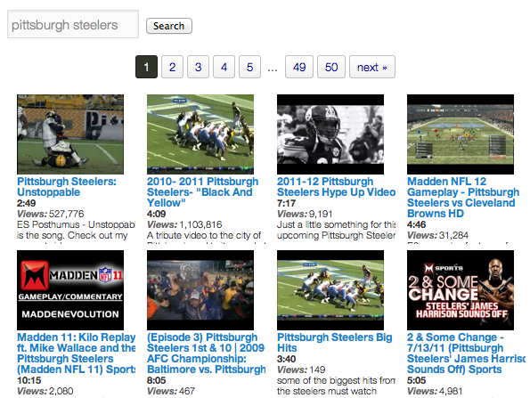

.. index::
   single: interactive search; overview

Interactive Searching
=====================

.. contents:: On this page
   :local:

.. _interactive-search-introduction:

Introduction
------------

TubePress provides an end-to-end solution for allowing your users to interactively search YouTube or Vimeo,
all without leaving your site. The image below is a simple example showing an interactive search input along with a
few results.

Like everything else with TubePress, interactive searching has loads of options and is fully customizable to suit
your needs. To use the feature, you'll need to invoke TubePress twice:

 1. Once for displaying the search input and
 2. Once more for displaying the user's search results

Let's go over each invocation in detail.

.. index::
   single: interactive search; input

.. _interactive-search-input:

Search Input
------------

Searching wouldn't be very fun if you didn't provide an easy way for your users to search. With TubePress, it's
really easy:

.. code-block:: php

  [tubepress output="searchInput"]

When invoked on your page, this shortcode will print out a search input box along with a submit button. If you'd
like to customize the HTML of either of these, you can edit your theme's HTML template at ``search/search_input.tpl.php``.

By default, the search form will submit back to the same page. If you want the results to show up on another page,
just set ``searchResultsUrl`` (most users shouldn't need to do this).

.. code-block:: php

  [tubepress output="searchInput" searchResultsUrl="http://mysite.com/videos.php"]

Now that you have a search input form, you'll need to invoke TubePress somewhere else to display the search results.

.. index::
   single: interactive search; output

.. _interactive-search-results-standard:

Search Results
--------------

Displaying search results is also easy. Add the following shortcode wherever on the page you'd like the search
results to show up:

.. code-block:: php

  [tubepress output="searchResults" searchProvider="vimeo"]

The ``searchProvider`` option can be set to either ``youtube`` or ``vimeo``, and this determines if the gallery will
display YouTube videos or Vimeo videos.

This shortcode will also display a placeholder gallery if the user isn't searching, but you can make it invisible until
it has search results by setting ``searchResultsOnly``:

.. code-block:: php

  [tubepress output="searchResults" searchProvider="youtube" searchResultsOnly="true"]

To configure the resulting thumbnail gallery of search results, simply add any TubePress options to this shortcode.

.. index::
   single: interactive search; output (Ajax)

.. _interactive-search-results-ajax:

Ajax-Enabled Search Results
---------------------------

With TubePress Pro, search results are displayed asynchronously (i.e. without a full page load). It's also a bit easier
to set up than standard searching because you only need to invoke TubePress once on the page. The only catch is you
also have to identify the DOM element where you want the search results to show up:

.. code-block:: php

  [tubepress output="ajaxSearchInput" searchResultsDomId="#somediv" searchProvider="vimeo"]

For the ``searchResultsDomId`` option value, just use any jQuery selector that uniquely identifies a DOM element that
can accept HTML. Like the standard search input, you can customize the HTML for the search input elements by editing
your theme's HTML template at ``search/ajax_search_input.tpl.php``.