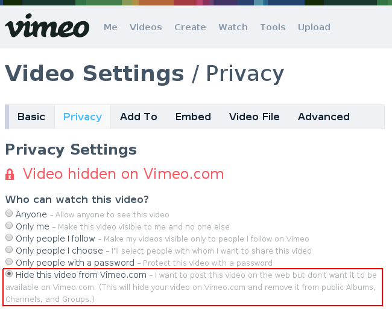

Vimeo All Access
==========================

.. contents:: On This Page
   :local:

.. _vimeo-all-access-intro:

Introduction
--------------

This TubePress add-on provides TubePress with enhanced access to your
Vimeo `Plus <https://vimeo.com/plus>`_ or `PRO <https://vimeo.com/pro>`_ account, thus allowing TubePress to work
with `private Vimeo videos <https://vimeo.com/help/faq/managing-your-videos/privacy-settings>`_.

This is particularly useful if you'd like to hide your videos from display on vimeo.com and *only* show them on
your TubePress-powered site. To make a video private, choose the last radio icon in the privacy settings for the video as
shown below:

.. _vimeo-all-access-manuals:

Manuals
----------

.. _vimeo-all-access-manual-wordpress:

TubePress for WordPress
^^^^^^^^^^^^^^^^^^^^^^^^^

 1. Purchase and download this add-on from `the TubePress Marketplace <http://community.tubepress.com/files/file/42-youtube-black-bars-remover/>`_.
 2. Unzip the file you downloaded (``vimeo-all-access_x_y_z.zip``) into the ``add-ons`` subdirectory of your
    :ref:`TubePress Content Directory <wordpress-tubepress-content-directory>`.
 3. Ensure you have completed the :ref:`one-time Vimeo API setup <wordpress-install-vimeo-api-setup>`.
 4. :ref:`Obtain your Vimeo access credentials <vimeo-all-access-obtain-token-and-secret>`.
 5. Supply your newly-obtained credentials (from Step 4) to TubePress at ``WP Admin > Settings > TubePress > Feed``. On this tab you will see two new text boxes for this add-on:

.. _vimeo-all-access-manual-php:

TubePress for PHP
^^^^^^^^^^^^^^^^^^^^^

 1. Purchase and download this add-on from `the TubePress Marketplace <http://community.tubepress.com/files/file/42-youtube-black-bars-remover/>`_.
 2. Unzip the file you downloaded (``vimeo-all-access_x_y_z.zip``) into the ``add-ons`` subdirectory of your
    :ref:`TubePress Content Directory <standalone-tubepress-content-directory>`.
 3. Ensure you have completed the :ref:`one-time Vimeo API setup <standalone-install-vimeo-api-setup>`.
 4. :ref:`Obtain your Vimeo access credentials <vimeo-all-access-obtain-token-and-secret>`.
 5. This add-on introduces two new options: :ref:`vimeoApiAccessToken <option-vimeoApiAccessToken>`  and
    :ref:`vimeoApiAccessTokenSecret <option-vimeoApiAccessTokenSecret>`. You may supply these options, along with
    :ref:`vimeoKey <option-vimeoKey>` and :ref:`vimeoSecret <option-vimeoSecret>`, to ``TubePressPro::getHtmlForShortcode()``. e.g.

  .. code-block:: php

     <?php

     print TubePressPro::getHtmlForShortcode('vimeoKey="xxxx" vimeoSecret="xxxx" vimeoAccessToken="xxxx" vimeoAccessTokenSecret="xxxx"');

.. _vimeo-all-access-manual-wix:

TubePress for Wix
^^^^^^^^^^^^^^^^^^^^^^^^^^^^^^^^^^^^^^^^

Users of cloud-based TubePress installations (e.g. TubePress Express, TubePress for Wix) should follow these instructions.

 1. :ref:`Obtain your Vimeo consumer credentials <vimeo-all-access-obtain-consumer-key-secret>`.
 2. :ref:`Obtain your Vimeo access credentials <vimeo-all-access-obtain-token-and-secret>`.
 3. Open up the full settings page for your TubePress instance by clicking the "More Settings" button:

   .. image:: ../../wix/images/wix-more-settings-button.png
 4. In the window that opens, navigate to the "Feed" tab and scroll down to the "Vimeo All Access" box:

   .. image:: images/wix-full-settings.png

 5. Enter the credentials obtained in Step 1 into the "Client ID" and "Client secret" text boxes.
 6. Enter the credentials obtained in Step 2 into the "Access Token" and "Access Token Secret" boxes.
 7. Click the "Save" button.

.. _vimeo-all-access-obtain-credentials:

Obtaining API Credentials
----------------------------

.. _vimeo-all-access-obtain-token-and-secret:

Access Token and Secret
^^^^^^^^^^^^^^^^^^^^^^^^^

You will need to supply an additional set of Vimeo API credentials to TubePress: an "Access Token" with a corresponding
"Access Token Secret". This is a one-time step for this add-on.

.. warning:: It is extremely important to never publicly divulge these credentials.

..

 1. Visit https://developer.vimeo.com/apps. You should see a list of any Vimeo apps that you have created. Click on the
    app that you are using for TubePress.
 2. At the bottom of the page, you will see a box containing your Access Token and Access Token Secret:

    .. image:: images/access-token-and-secret.png

.. _vimeo-all-access-obtain-consumer-key-secret:

Consumer Key (Client ID) and Secret
^^^^^^^^^^^^^^^^^^^^^^^^^^^^^^^^^^^^

.. note:: Only cloud-based TubePress users (e.g. TubePress Express, TubePress for Wix, etc) need to follow these instructions,
          as users of downloadable distributions of TubePress should have completed this step during installation.

..

 1. `Log in to Vimeo <http://vimeo.com/log_in>`_, if you haven't already.
 2. `Click here <https://developer.vimeo.com/apps/new>`_ to create a new Vimeo app. You can fill in anything
    for the fields. Below is a sample form that's filled out. Then click the `Create App` button.

    .. image:: ../../_shared/installation/images/vimeo_new_app.png

 3. Make a note of the "Client ID" and "Client secret" of your new app. See the red box below for an idea
    of what it should look like.

    .. image:: ../../_shared/installation/images/vimeo_new_keys.png