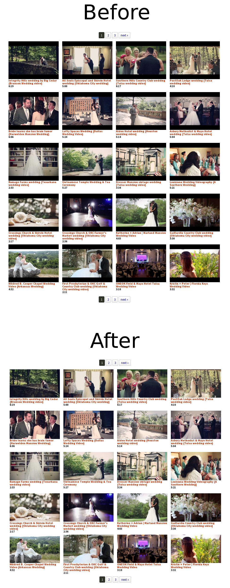
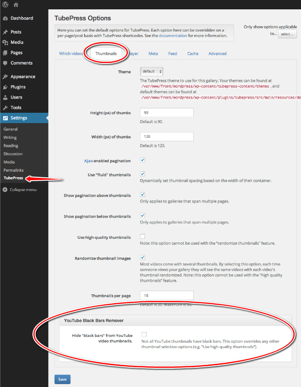

YouTube Black Bars Remover
==========================

.. contents:: On This Page
   :local:

.. _youtube-bbr-intro:

Introduction
--------------

Most YouTube video thumbnails have horizontal black bars on the top and bottom. This TubePress add-on completely
removes these bars, leaving behind a clean and more professional image.

.. note:: Use of this add-on will change the aspect ratio of YouTube thumbnails from 4:3 to 16:9. You will likely want to adjust your settings for :ref:`thumbHeight <option-thumbHeight>` and :ref:`thumbWidth <option-thumbWidth>`.

.. _youtube-bbr-installation:

Installation
-------------

.. note:: Cloud-hosted TubePress installations have this add-on installed automatically. Only users of the downloadable distributions of TubePress will need to follow these installation instructions.

..

 1. Purchase and download this add-on from `the TubePress Marketplace <http://community.tubepress.com/files/file/42-youtube-black-bars-remover/>`_.
 2. Unzip the file you downloaded (``youtube-black-bars-remover_x_y_z.zip``) into the ``add-ons`` subdirectory of your
    TubePress Content Directory. (instructions for :ref:`Standalone PHP users <standalone-tubepress-content-directory>`, :ref:`WordPress users <wordpress-tubepress-content-directory>`)

.. _youtube-bbr-usage:

Usage
------

.. contents::
   :local:

.. _youtube-bbr-usage-wordpress:

WordPress
^^^^^^^^^^

In WordPress, you can configure this add-on from ``WP Admin > Settings > TubePress``. Navigate to the "Thumbnails" tab
and scroll to the bottom of the page. There you will see a checkbox which enables/disables the black bar removal.

.. _youtube-bbr-usage-standalone:

Standalone PHP & WordPress Templates
^^^^^^^^^^^^^^^^^^^^^^^^^^^^^^^^^^^^^^

This add-on introduces the ``youtubeHideBlackBars`` option that you may supply to ``TubePressPro::getHtmlForShortcode()``. e.g.

.. code-block:: php

   <?php

   print TubePressPro::getHtmlForShortcode('mode="user" userValue="3hough" youtubeHideBlackBars="true"');

