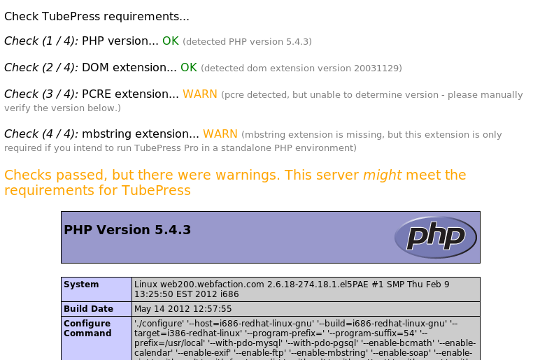

Install / Upgrade
=================

This page details how to install, upgrade, and uninstall TubePress when used as a standalone PHP
library.

.. contents:: On this page
   :local:

.. _standalone-requirements:

Requirements
------------

.. include:: ../_shared/installation/common_requirements.rst

Additionally, if you intend to use TubePress in any language other than English,
TubePress for PHP requires the `PHP Multibyte String extension`_ (enabled in most PHP installations).

.. _PHP Multibyte String extension: http://php.net/manual/en/book.mbstring.php

Not sure if your server meets these requirements? You should either

 1. Ask your hosting provider (good idea to include a link to this page!)
 2. Use our PHP file which checks your server for the requirements. Here's how to use it:

   1. Using a web browser, visit `this URL <https://gist.github.com/raw/3168023/a989ee33f3783137a69b81636a506409d725b578/check.php>`_. You'll see some PHP source code.
   2. Save the source code to disk (``File > Save`` from your web browser's menu, or just hit ``Ctrl-S``). It should be saved somewhere on your local machine, and the name of the file should be ``check.php``.
   3. Upload ``check.php`` to your website's document root.
   4. Using a web browser, visit ``http://<yourdomain.com>/check.php``. The output of this page should be self-explanatory and will look similar to the following:

.. _standalone-installation:

Install
-------

Here's how to install TubePress Pro when used as a standalone PHP library.

 1. If you haven't already, `purchase a TubePress Pro license <http://community.tubepress.com/files/file/11-tubepress-pro/>`_.
 2. Download TubePress Pro from `here <http://community.tubepress.com/files/file/11-tubepress-pro/>`_.
 3. Unzip the file you just downloaded (``tubepress_pro_x_y_z.zip``). It will expand into a directory named
    ``tubepress_pro_x_y_z``. (Note: ``x``, ``y``, and ``z`` are the major, minor, and micro version numbers of TubePress).
 4. Upload the entire ``tubepress_pro_x_y_z`` directory to your web server in a place that's *web accessible*.
 5. Make a note of the following two items, which you'll need when invoking TubePress:

    * the full path of this directory on your web server's filesystem (e.g. ``/var/www/html/myblog.com/lib/tubepress_pro_x_y_z``)
    * the web-accessible URL to reach this directory (e.g. ``http://myblog.com/lib/tubepress_pro_x_y_z``)

 6. *Vimeo users only*. Perform the :ref:`one-time Vimeo API setup <standalone-install-vimeo-api-setup>`.
 7. *Optional*. :ref:`Install support for Shadowbox.js and/or JW Player 5 <standalone-install-optional-pro-installs>`.

.. _standalone-install-vimeo-api-setup:

Vimeo API Setup
^^^^^^^^^^^^^^^

.. include:: ../_shared/installation/vimeo_api_setup.rst

That's it! You now simply need to provide these credentials to TubePress. You'll have to provide the key and
secret via the :ref:`vimeoKey <option-vimeoKey>` and :ref:`vimeoSecret <option-vimeoSecret>` options in TubePress.
You can pass these into the ``getHtmlForShortcode()`` function:

.. code-block:: php

  <?php print TubePressPro::getHtmlForShortcode('vimeoKey="M7e8oGsvU8Ld4TW7e8oLsvU8Ld4TM7e8oLs" vimeoSecret="GqOGYnQ3Fv9emI" mode="vimeoSearch" vimeoSearchValue="pittsburgh steelers"'); ?>

Make sure not to mix up the "key" and the "secret"!

.. _standalone-install-optional-pro-installs:

Optional TubePress Pro Installations
^^^^^^^^^^^^^^^^^^^^^^^^^^^^^^^^^^^^

Due to licensing restrictions, TubePress Pro does not ship with every library that the free WordPress plugin includes.
However it's very easy to install these optional libraries manually. This section provides installation instructions.

.. _standalone-install-jw-player-5x:

JW Player (version 5.x)
~~~~~~~~~~~~~~~~~~~~~~~

.. include:: ../_shared/installation/jw-player-5x-installation.rst

.. _standalone-install-shadowboxjs:

Shadowbox.js
~~~~~~~~~~~~

.. include:: ../_shared/installation/shadowbox-js-installation.rst

.. _standalone-upgrade:

Upgrade
-------

The easiest and most reliable way to upgrade TubePress Pro is to perform a side-by-side installation with the
new version alongside the old. Here's the exact process.

 1. Repeat the `TubePress Pro installation procedure <standalone-installation>`_ with the latest copy of TubePress Pro.
 2. *Optional*. Copy over the TubePress Content Directory from your old TubePress installation (``tubepress_pro_x_y_z>/tubepress-content``). This is only required if you are using custom TubePress add-ons or themes.
 3. In the PHP files where you use TubePress Pro, edit ``TubePressPro::setBaseUrl()`` and the path to ``TubePressPro.php`` to point to your new install location.