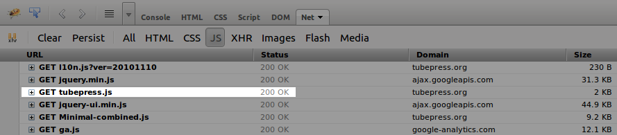
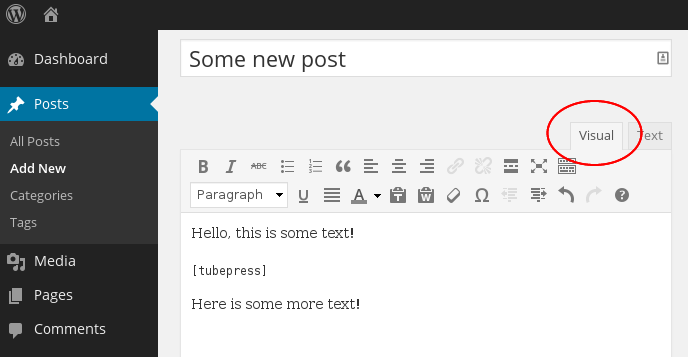
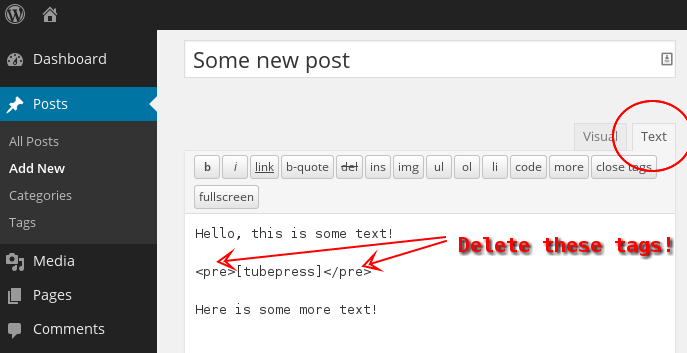

FAQ & Troubleshooting
=====================

.. contents:: On This Page
   :local:

.. _wordpress-troubleshoot-common-problems:

Common Problems
---------------

Use the table below to find a solution to your problem.

+--------------------------------------------------------+--------------------------------------------------------------+
| Problem                                                | Possible causes and solutions                                |
+========================================================+==============================================================+
| Video thumbnails are "unclickable"                     | * :ref:`wordpress-troubleshoot-javascript-errors`            |
|                                                        | * :ref:`wordpress-troubleshoot-missing-tubepress-js`         |
|                                                        | * :ref:`wordpress-troubleshoot-multiple-instances-of-jquery` |
+--------------------------------------------------------+--------------------------------------------------------------+
| After clicking thumbnail, video never loads            | * :ref:`wordpress-troubleshoot-cross-domain-ajax`            |
+--------------------------------------------------------+--------------------------------------------------------------+
| Layout is unstyled or ugly                             | * :ref:`wordpress-troubleshoot-visual-editor`                |
+--------------------------------------------------------+--------------------------------------------------------------+
| My videos aren't showing up with TubePress             | * :ref:`wordpress-troubleshoot-api-latency`                  |
+--------------------------------------------------------+--------------------------------------------------------------+

.. _wordpress-troubleshoot-javascript-errors:

JavaScript Errors
#################

.. include:: ../_shared/troubleshooting/javascript-errors.rst

.. _wordpress-troubleshoot-cross-domain-ajax:

Cross-Domain Ajax
#################

.. include:: ../_shared/troubleshooting/cross-domain-ajax.rst

.. _wordpress-troubleshoot-missing-tubepress-js:

Missing ``tubepress.js``
########################

Any page that uses TubePress needs to have ``tubepress.js`` loaded somewhere in the document. If this file
is missing, your gallery's thumbnails won't respond to clicks.

To diagnose if this if your problem, you can view your HTML source or use Firebug to verify if this file is being
loaded correctly. The image below shows what a correct load will look like in Firebug.

In WordPress, this file will be automatically loaded via your theme's ``wp_head()`` function invocation. However, some
custom themes will (accidentally or intentionally) omit this call. Switching back to the "Twenty Thirteen" WordPress
theme will verify if your custom theme is the culprit.
`Here <http://josephscott.org/archives/2009/04/wordpress-theme-authors-dont-forget-the-wp_head-function/>`_ is some
further information on including the ``wp_head()`` function in your theme.

.. _wordpress-troubleshoot-multiple-instances-of-jquery:

Multiple Instances of jQuery
############################

This problem is much more prevalent in WordPress-based sites, where other plugin and theme authors fail to include
jQuery "`the right way`_". Multiple loads of
jQuery will not only significantly hurt the load-time of your site, but it will also break TubePress.

There are two ways to see if your site is loading jQuery more than once:

 1. Inspect your HTML source, hit ``Ctrl-F`` and search for "jquery". You should only see one JavaScript file
    loaded for jQuery.
 2. Use Firebug's "Net" tab to examine the scripts loaded on your page. The image below shows what multiple jQuery
    loads looks like in Firebug.

    .. image:: images/troubleshooting/multiple_jquery_loads.png

The solution in this case is to pare down your scripts to a single jQuery load. How this solution is accomplished
depends on your environment.

 * In TubePress Pro for PHP, this will usually involve simply editing your site's header to only include jQuery once.
 * In TubePress for WordPress, typically the best method is to disable your plugins one-by-one until you find the
   offending plugin and/or theme. At that point, you'll need to either edit the plugin/theme's PHP or ask the original
   author to include jQuery "`the right way`_".

.. _the right way: http://digwp.com/2009/06/including-jquery-in-wordpress-the-right-way/

.. _wordpress-troubleshoot-visual-editor:

WordPress's Visual Editor Interference
######################################

When authoring a post or a page from your WordPress administrative dashboard, WordPress allows you to use both the
`Visual Editor as well as the Text Editor <http://make.wordpress.org/support/user-manual/content/editors/>`_. Unfortunately
the Visual Editor sometimes "wraps" TubePress shortcodes with HTML ``<pre>`` or ``<code>`` tags. This can ruin
the appearance of TubePress, often resulting in incorrect font faces or "diagonal" thumbnail layouts.

The solution is to use WordPress's Text Editor and remove any ``<pre>`` or ``<code>`` tags near your ``[tubepress]``
shortcodes.

.. _wordpress-troubleshoot-api-latency:

API Latency
###########

.. include:: ../_shared/troubleshooting/api-latency.rst

.. _wordpress-troubleshoot-tools:

Troubleshooting Tools
---------------------

.. _wordpress-troubleshoot-debugging-mode:

Debugging Mode
##############

.. include:: ../_shared/troubleshooting/debugging-mode.rst

.. _wordpress-troubleshoot-firebug:

Firebug
#######

.. include:: ../_shared/troubleshooting/firebug.rst
