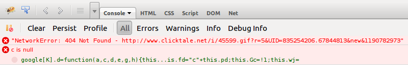

FAQ & Troubleshooting
=====================

.. contents:: On This Page
   :local:

.. _wordpress-troubleshoot-common-problems:

Common Problems
---------------

Use the table below to find a solution to your problem.

+--------------------------------------------------------+--------------------------------------------------------------+
| Problem                                                | Possible causes and solutions                                |
+========================================================+==============================================================+
| Video thumbnails are "unclickable"                     | * :ref:`wordpress-troubleshoot-javascript-errors`            |
|                                                        | * :ref:`wordpress-troubleshoot-missing-tubepress-js`         |
|                                                        | * :ref:`wordpress-troubleshoot-multiple-instances-of-jquery` |
+--------------------------------------------------------+--------------------------------------------------------------+
| After clicking thumbnail, video never loads            | * :ref:`wordpress-troubleshoot-cross-domain-ajax`            |
+--------------------------------------------------------+--------------------------------------------------------------+
| Layout is unstyled or ugly                             | * :ref:`wordpress-troubleshoot-visual-editor`                |
+--------------------------------------------------------+--------------------------------------------------------------+
| My videos aren't showing up with TubePress             | * :ref:`wordpress-troubleshoot-api-latency`                  |
+--------------------------------------------------------+--------------------------------------------------------------+

.. _wordpress-troubleshoot-javascript-errors:

JavaScript Errors
#################

If your website has JavaScript errors, they can prevent TubePress from operating correctly.

TubePress expects your page to load cleanly; i.e. there should be no JavaScript errors caused by other scripts,
plugins, themes, etc. The reason is that TubePress relies on jQuery's `ready() <http://api.jquery.com/ready/>`_
function, which can get interrupted if other scripts cause errors.

To diagnose if this is your problem, use the following procedure:

 1. Using Firefox, navigate to a page with a TubePress gallery
 2. Open up :ref:`firebug`
 3. Open Firebug's "Console" tab
 4. Refresh the page.
 5. Check Firebug's console for JavaScript errors

The image below shows what JavaScript errors look like in Firebug.

**The resolution is always to fix the script causing the error**. Usually this entails identifying which component of your
site (script, plugin, etc) is causing the error. Unfortunately since sites can get extremely complicated, there's
no "one size fits all" solution.

Typically by hovering over the JavaScript errors in Firebug, you can pinpoint which JavaScript file is causing the trouble.

.. _wordpress-troubleshoot-cross-domain-ajax:

Cross-Domain Ajax
#################

TubePress uses `Ajax <http://en.wikipedia.org/wiki/Ajax_(programming)>`_ extensively in the browser - e.g. to
asynchronously load the video player whenever a user clicks a thumbnail. By virtue of this, TubePress is forced
to adhere to the `same origin policy <http://en.wikipedia.org/wiki/Same_origin_policy>`_ of JavaScript. The same origin
policy should be embraced - at least until the Internet settles on
a `new policy <http://en.wikipedia.org/wiki/Cross-origin_resource_sharing>`_ - as its a crucial guard against malicious
sites.

However, this means that a small domain misconfiguration can lead to a broken/misbehaving TubePress installation.

As an example, say that you have a domain ``ehough.com`` and are serving a web site at this address;
loading up ``http://ehough.com`` works normally for your users, and TubePress detects that ``ehough.com`` is the domain
that it will use. But you *also* have the site available (without HTTP redirects) via ``http://www.ehough.com``.
Users that access the site via the ``www.ehough.com`` domain will experience a
broken TubePress installation, as TubePress will attempt to make a cross-domain Ajax request to ``ehough.com``.

To diagnose if this if your problem, use the following procedure:

  1. Using Firefox, navigate to a page with a TubePress gallery
  2. Open up :ref:`firebug`
  3. Open Firebug's "Console" tab
  4. Click on any TubePress thumbnail. You should see a new XHR request show up as TubePress performs its Ajax request.

     .. image:: ../_shared/troubleshooting/images/cross_domain_xhr.png

  5. Expand this request (using the expand icon on the left) to view the results. You should see a small/medium
     `JSON <http://www.json.org/>`_ result. If you see **anything** else here, or nothing at all, then something is wrong

     .. image:: ../_shared/troubleshooting/images/cross_domain_xhr_result.png

To fix this issue, `Google recommends <http://support.google.com/webmasters/bin/answer.py?hl=en&answer=66359>`_ to
choose a "preferred domain" and stick with it. Here are some guidelines on how to achieve this:

 * Use HTTP 301 redirects ("RedirectPermanent") in your .htaccess file to smartly redirect users to your preferred domain.
   * In Apache, you can do this with an .htaccess file.
   * In IIS, you can do this through the administrative console.
 * WordPress users should make sure that both their "Site Address" and "WordPress Address" match their preferred domain
   (you can set these at ``WP Admin > Settings > General``)
 * If you use TubePress Pro in a PHP environment, make sure that the domain you set with ``TubePressPro::setBaseUrl()``
   matches your preferred domain

.. _wordpress-troubleshoot-missing-tubepress-js:

Missing ``tubepress.js``
########################

Any page that uses TubePress needs to have ``tubepress.js`` loaded somewhere in the document. If this file
is missing, your gallery's thumbnails won't respond to clicks.

To diagnose if this if your problem, you can view your HTML source or use :ref:`firebug` to verify if this file is being
loaded correctly. The image below shows what a correct load will look like in Firebug.

.. image:: images/troubleshooting/tubepress-js-load.png

In WordPress, this file will be automatically loaded via your theme's ``wp_head()`` function invocation. However, some
custom themes will (accidentally or intentionally) omit this call. Switching back to the "Twenty Thirteen" WordPress
theme will verify if your custom theme is the culprit.
`Here <http://josephscott.org/archives/2009/04/wordpress-theme-authors-dont-forget-the-wp_head-function/>`_ is some
further information on including the ``wp_head()`` function in your theme.

If you're using TubePress in a standalone PHP environment, following the basic invocation instructions will
load correctly ``tubepress.js`` for you.

.. _wordpress-troubleshoot-multiple-instances-of-jquery:

Multiple Instances of jQuery
############################

This problem is much more prevalent in WordPress-based sites, where other plugin and theme authors fail to include
jQuery "`the right way`_". Multiple loads of
jQuery will not only significantly hurt the load-time of your site, but it will also break TubePress.

There are two ways to see if your site is loading jQuery more than once:

 1. Inspect your HTML source, hit ``Ctrl-F`` and search for "jquery". You should only see one JavaScript file
    loaded for jQuery.
 2. Use Firebug's "Net" tab to examine the scripts loaded on your page. The image below shows what multiple jQuery
    loads looks like in Firebug.

    .. image:: images/troubleshooting/multiple_jquery_loads.png

The solution in this case is to pare down your scripts to a single jQuery load. How this solution is accomplished
depends on your environment.

 * In TubePress Pro for PHP, this will usually involve simply editing your site's header to only include jQuery once.
 * In TubePress for WordPress, typically the best method is to disable your plugins one-by-one until you find the
   offending plugin and/or theme. At that point, you'll need to either edit the plugin/theme's PHP or ask the original
   author to include jQuery "`the right way`_".

.. _the right way: http://digwp.com/2009/06/including-jquery-in-wordpress-the-right-way/

.. _wordpress-troubleshoot-visual-editor:

WordPress's Visual Editor Interference
######################################

When authoring a post or a page from your WordPress administrative dashboard, WordPress allows you to use both the
`Visual Editor as well as the Text Editor <http://make.wordpress.org/support/user-manual/content/editors/>`_. Unfortunately
the Visual Editor sometimes "wraps" TubePress shortcodes with HTML ``<pre>`` or ``<code>`` tags. This can ruin
the appearance of TubePress, often resulting in incorrect font faces or "diagonal" thumbnail layouts.

The solution is to use WordPress's Text Editor and remove any ``<pre>`` or ``<code>`` tags near your ``[tubepress]``
shortcodes.

.. image:: images/troubleshooting/wp-visual-editor.png

.. image:: images/troubleshooting/wp-text-editor.png

.. _wordpress-troubleshoot-api-latency:

API Latency
###########

.. include:: ../_shared/troubleshooting/api-latency.rst

.. _wordpress-troubleshoot-tools:

Troubleshooting Tools
---------------------

.. _wordpress-troubleshoot-debugging-mode:

Debugging Mode
##############

.. include:: ../_shared/troubleshooting/debugging-mode.rst

.. _wordpress-troubleshoot-firebug:

Firebug
#######

