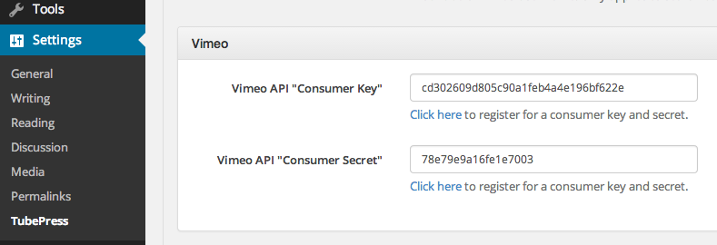

Install / Upgrade
=================

This page details how to install, upgrade, and uninstall TubePress when used as a WordPress plugin.

.. contents:: On this page
   :local:

.. _wordpress-requirements:

Requirements
------------

.. include:: ../_shared/installation/common_requirements.rst

Not sure if your server meets these requirements? You should either

 1. Ask your hosting provider (good idea to include a link to this page!)
 2. Install a WordPress plugin that prints out system information. Here are some examples:

   * `WordPress phpinfo()`_
   * `WP-ServerInfo`_

.. _WordPress phpinfo(): http://wordpress.org/plugins/wordpress-php-info/
.. _WP-ServerInfo:       http://wordpress.org/plugins/wp-serverinfo/

.. _wordpress-installation:

Install
-------

.. _wordpress-install-free:

Free Version
^^^^^^^^^^^^

Installing the free WordPress plugin is simple. The easiest method is from your WordPress dashboard.

 1. Follow `these instructions <http://codex.wordpress.org/Managing_Plugins#Automatic_Plugin_Installation>`_
    to perform the plugin installation and activation. You can search for ``tubepress``
    and it should come up as the first result.

    .. image:: images/installation/wordpress_easy_install.png
       :alt: TubePress installation via the WordPress dashboard

 2. *Vimeo users only*. Perform the :ref:`one-time Vimeo API setup <wordpress-install-vimeo-api-setup>`.

If the dashboard installation method is not available, or if you'd prefer to install the plugin manually,
here's how to do it.

 1. Download the plugin from `its page on wordpress.org <http://wordpress.org/plugins/tubepress/>`_.
 2. Follow `these instructions <http://codex.wordpress.org/Managing_Plugins#Manual_Plugin_Installation>`_ to
    finish the manual installation and activation.
 3. *Vimeo users only*. Perform the :ref:`one-time Vimeo API setup <wordpress-install-vimeo-api-setup>`.

.. _wordpress-install-pro:

TubePress Pro
^^^^^^^^^^^^^

Installation of TubePress Pro into a WordPress environment must be performed manually, since TubePress Pro is
*open* but not *public* source code.

 1. If you haven't already, `purchase a TubePress Pro license <http://community.tubepress.com/files/file/11-tubepress-pro/>`_.
 2. Download TubePress Pro from `here <http://community.tubepress.com/files/file/11-tubepress-pro/>`_.
 3. Follow `these instructions <http://codex.wordpress.org/Managing_Plugins#Manual_Plugin_Installation>`_ to
    finish the manual installation and activation of the plugin.
 4. *Vimeo users only*. Perform the :ref:`one-time Vimeo API setup <wordpress-install-vimeo-api-setup>`.
 5. *Optional*. :ref:`Install support for Shadowbox.js and/or JW Player 5 <wordpress-install-optional-pro-installs>`.

.. _wordpress-install-vimeo-api-setup:

Vimeo API Setup
^^^^^^^^^^^^^^^

.. include:: ../_shared/installation/vimeo_api_setup.rst

That's it! You now simply need to provide these credentials to TubePress. You can do this from
``WP Admin > Settings > TubePress > Feed``.

Make sure not to mix up the "key" and the "secret"!

.. _wordpress-install-optional-pro-installs:

Optional TubePress Pro Installations
^^^^^^^^^^^^^^^^^^^^^^^^^^^^^^^^^^^^

Due to licensing restrictions, TubePress Pro does not ship with every library that the free WordPress plugin includes.
However it's very easy to install these optional libraries manually. This section provides installation instructions.

.. _wordpress-install-jw-player-5x:

JW Player (version 5.x)
~~~~~~~~~~~~~~~~~~~~~~~

.. include:: ../_shared/installation/jw-player-5x-installation.rst

.. _wordpress-install-shadowboxjs:

Shadowbox.js
~~~~~~~~~~~~

.. include:: ../_shared/installation/shadowbox-js-installation.rst

.. _wordpress-upgrade:

Upgrade
-------

This page details the official upgrade procedures for TubePress. The installation steps are different depending on if
you are using TubePress Pro or the free version of TubePress.

.. _wordpress-upgrade-free-plugin:

Free Version
^^^^^^^^^^^^

We strongly recommend using
`WordPress's built-in update mechanism <http://codex.wordpress.org/Managing_Plugins#Plugin_Compatibility_and_Updates>`_
to keep the free version of TubePress up to date.

If you would rather upgrade manually, here is the procedure:

 1. Deactivate TubePress from ``WP Admin > Plugins``.
 2. Remove the existing TubePress installation directory from ``wp-content/plugins/tubepress``.
 3. Repeat the :ref:`free WordPress plugin installation procedure <wordpress-install-free>`.

.. _wordpress-upgrade-pro:

TubePress Pro
^^^^^^^^^^^^^

.. caution:: **Do not use WordPress's auto-update for TubePress Pro!** Your installation will be downgraded to the free
             version of TubePress.

Here is the safe upgrade procedure for TubePress Pro when used in WordPress:

 1. Deactivate TubePress Pro from ``WP Admin > Plugins``.
 2. Remove the existing TubePress Pro installation directory from ``wp-content/plugins/tubepress_pro_x_y_z``.
 3. Repeat the :ref:`TubePress Pro installation procedure <wordpress-install-pro>` with the latest
    copy of TubePress Pro.

.. _wordpress-uninstall:

Uninstall
---------

If you'd like to completely uninstall TubePress from your WordPress installation for any reason, here are the steps:

 1. Deactivate TubePress from ``WP Admin > Plugins``.
 2. Remove the TubePress installation directory from ``wp-content/plugins/``.