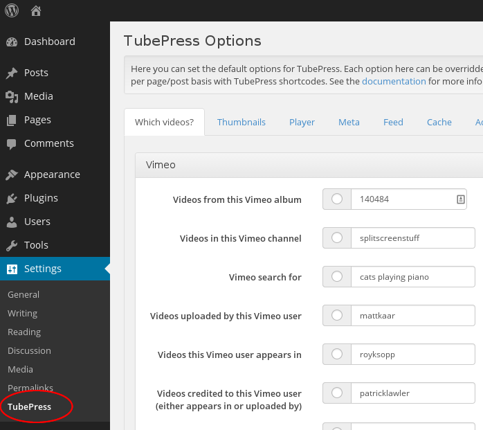

.. _wordpress-basic-usage:

Using TubePress in WordPress
============================

.. contents:: On This Page
   :local:

.. _basic-wordpress-configuration:

Configuration
-------------

TubePress comes with a user-friendly options page that can be found from your WordPress admin dashboard. Simply
visit ``Settings > TubePress`` to access the screen.

.. _wordpress-posts-pages-usage:

Add TubePress to Posts and Pages
--------------------------------

Follow these instructions to use TubePress (free or Pro) in WordPress posts and/or pages. It's dead simple. Simply type

.. code-block:: php

  [tubepress]

anywhere in a WordPress post or page. When a user visits this post/page, TubePress will replace
``[tubepress]`` with its generated HTML content.

You can configure the default TubePress options from within your WordPress administration dashboard by visiting
``Settings > TubePress``. If you just type ``[tubepress]`` on a post or a page, these options will be used.
**The real power of the plugin lies in the ability to be invoked in unique ways on multiple posts and pages**. This is
done by passing options to the ``[tubepress]`` shortcode. For example, say
on one page you want to display a gallery of YouTube videos that are tagged with "football", want 15 videos per page,
and want to play the videos in an HTML poupup window. On this page, you would type

.. code-block:: php

  [tubepress mode="tag" tagValue="football" playerLocation="popup" resultsPerPage="15"]

on the page where you want the gallery to show up. And say on another page you want to display a different gallery
with the options that you set in ``Settings > TubePress``. On this page you would type

.. code-block:: php

  [tubepress]

where you want TubePress to inject its content. Follow this procedure for unlimited galleries on
unlimited posts/pages. Just use any TubePress shortcode to control the gallery content.

Add TubePress to WordPress Templates
------------------------------------

TubePress Pro only. Follow these instructions to use TubePress Pro inside WordPress templates. The code snippet
below shows the `world's simplest WordPress template`_ with TubePress Pro added. As you can see by the highlighted lines
below, there are only 2 steps:

.. _world's simplest WordPress template: http://codex.wordpress.org/The_Loop_in_Action#The_World.27s_Simplest_Index_Page

.. code-block:: php
   :linenos:
   :emphasize-lines: 3,7

   <?php

     include WP_PLUGIN_DIR . '/tubepress_pro_x_y_z/src/main/php/classes/TubePressPro.php';

     get_header();

     print TubePressPro::getHtmlForShortcode('mode="tag" tagValue="pittsburgh steelers"');

     if (have_posts()) :
        while (have_posts()) :
           the_post();
           the_content();
        endwhile;
     endif;
     get_sidebar();
     get_footer();
   ?>

Notes on the two highlighted lines above:

 1. Include the TubePress Pro library file ``TubePressPro.php``.
 2. The ``getHtmlForShortcode()`` static function takes a single string parameter which is any valid
    TubePress shortcode. It returns the HTML output of TubePress. You may repeat this function call as many
    times as you like.

Changing the Default Language
-----------------------------

.. include:: ../_shared/snippets/i18n_intro.rst

TubePress will determine which language to use based on the ``WP_LANG`` setting that you can define in ``wp-config.php``.
Details for how to switch the language of your WordPress blog can
be found `here <http://codex.wordpress.org/WordPress_in_Your_Language>`_.